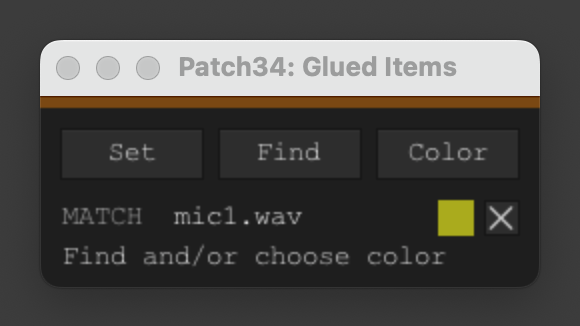

# Patch34: Find and Recolor Glued Items

Scripts and tools for REAPER. Useful, weird, and everything in between.

  

Capture an item name, then find, recolor, and auto-color its glued derivatives anywhere in the project. Useful when glued copies have scattered across the timeline and need to be rounded up or visually tagged.

No js_ReaScriptAPI required.

## Installation

1. In REAPER: **Actions → Show action list…**
2. Click **ReaScript: Load…**
3. Select `Patch34_Find_and_Recolor_Glued_Items.lua`
4. Optionally assign a keyboard shortcut or add to toolbar

## How it works

**Set** — captures the visible name of the selected item (item name if set, otherwise active take name).

**Find** — selects all glued derivatives across the project. Available as soon as a name is set, no color required.

**Color** — opens a color picker and paints all matching glued derivatives. Once a color is assigned, new derivatives are painted automatically whenever a Glue action is detected.

**Reset** — clears the name, color, and auto-color rule.

Matching logic: targets items whose name contains the source name (or its stem) and "glued" — e.g. `MIC2.WAV-glued-01`, `MIC2-Glued-001`.

## Notes

- Auto-color triggers on Glue by watching the undo stack — no background process required
- The color swatch reflects the currently assigned color
- Find and Color are disabled until a name is set

## License

MIT
